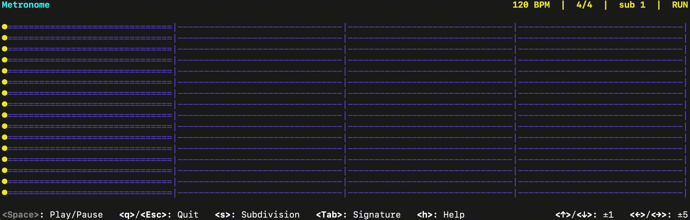

## Metronome

A precise, terminal-based CLI metronome with audio and live controls.

<p align="center">
  
</p>

### Install

```bash
cargo build --release
# optional
cargo install --path .
```

### Run

```bash
metronome [OPTIONS] [BPM] [SUBCOMMAND]
```

### Options

- **[BPM]**: optional positional BPM (20–400). Overrides --bpm when provided.
- **-b, --bpm <NUM>**: starting BPM (20–400). Default: 120.
- **-s, --signature <M/N>**: time signature (denominator one of 1,2,4,8,16). Default: 4/4.
- **--subdivision <quarter|eighth|triplet|sixteenth>**: ticks per beat. Default: quarter.
- **--sound <click|wood|cowbell|sidestick|beep>**: click sound. Default: click.
- **--mute**: disable audio output.

### Subcommands

- **tap**: tap tempo on the keyboard; the measured BPM is applied to the session.
- **ramp <FROM..TO@DURATION>**: linearly ramp BPM over a duration.
  - Examples: `120..160@2m`, `90..120@30s`, `100..80@500ms`.

### Keyboard controls (while running)

- **Space**: Play/Pause
- **q / Esc**: Quit
- **↑ / ↓**: BPM ±1
- **← / →**: BPM ±5
- **s**: Cycle subdivision (quarter → eighth → triplet → sixteenth)
- **Tab**: Cycle common signatures (4/4 → 3/4 → 6/8 → 7/8)
- **h**: Toggle on-screen help

### Examples

```bash
# Start at 100 BPM
metronome 100

# Specify signature, subdivision, sound, and BPM flag
metronome --signature 7/8 --subdivision sixteenth --sound wood --bpm 140

# Ramp from 100 to 140 BPM over 2 minutes
metronome ramp "100..140@2m"

# Tap tempo, then start at the measured BPM
metronome tap
```
